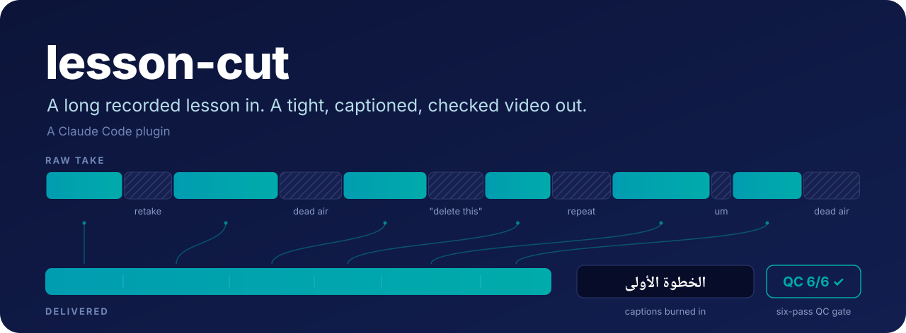
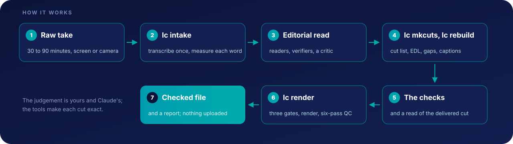

<p align="center">
  
</p>

<p align="center">
  <a href="CHANGELOG.md"></a>
  
  <a href="LICENSE"></a>
  
  
</p>

<p align="center">
  <a href="#install"><b>Install</b></a> &nbsp;·&nbsp;
  <a href="#first-run"><b>First run</b></a> &nbsp;·&nbsp;
  <a href="GUIDE.md"><b>The guide</b></a> &nbsp;·&nbsp;
  <a href="docs/lesson-cut-guide.pdf"><b>PDF</b></a> &nbsp;·&nbsp;
  <a href="CHANGELOG.md"><b>Changelog</b></a>
</p>

<!-- demo: a short before/after clip goes here. Upload it as a GitHub attachment; takes and renders are gitignored. -->

You hand it a raw take, 30 to 90 minutes of someone building or explaining something live. It
produces a finished file with every retake, repeated section, failed attempt, spoken "delete this"
and stretch of dead air removed, captions burned in, and every check run before the render. The
standard it aims at is that a viewer cannot tell where the joins are.

It is not a magic button. It is a method, a set of agents that carry out the method, and two dozen
tools that make the mechanical parts reliable. The judgement stays with you and with Claude; the
tools exist so that no cut lands inside a word and no defect reaches a render.

## What it removes

| From the take | What happens to it |
|---|---|
| **Retakes and abandoned attempts** | cut, keeping the last complete one |
| **Repeated sentences and sections** | cut, so each idea is said once |
| **Spoken instructions to the editor** ("delete this", «احذف هاي») | cut together with what they refer to, and only as far back as what is said again afterwards |
| **Failed on-screen actions** and their retries | cut (a dictation that never landed, a click that did nothing) |
| **Truncated words, doubled words, stutters, standalone fillers** | cut at measured word edges, never inside a word |
| **Wordless gaps** | trimmed to a short beat, keeping a glimpse of the screen during long waits |

It does not upload or publish anything, and it does not decide for you: it stops at a rendered,
checked file and a report.

## How it works

- **A method** (the `lesson-cut` skill): how to decide what to cut, written down precisely enough
  that an agent can apply it. This is the part that makes the result feel clean.
- **Agents** that carry the method out at scale: a window reader, an adversarial verifier and a
  completeness critic.
- **A toolchain** of about two dozen scripts behind one command, `lc`: it places every cut edge in
  silence, and it refuses to render until a set of checks is clean.

<p align="center">
  
</p>

The QC gate's six passes cover the transcript, the caption data, the caption pixels, the video
frames, the audio and the file spec. [Chapter 12 of the guide](GUIDE.md#12-the-checks-and-what-each-one-alone-can-see)
says what each one catches and why each exists.

## What it needs

| Requirement | Notes |
|---|---|
| **Claude Code** | runs the plugin and its agents |
| **ffmpeg and ffprobe, with libass** | burns the captions. macOS: `brew install ffmpeg-full` (the plain `ffmpeg` formula has no libass). Debian or Ubuntu: `sudo apt install ffmpeg` |
| **Python 3.9 or newer** | on Debian or Ubuntu, also `python3-venv` |
| **A transcript source** | an ElevenLabs API key (paid), or local whisper (no key, no cost, slower) |
| **The caption font** | Almarai ExtraBold by default, free under the SIL Open Font License 1.1 from [Google Fonts](https://fonts.google.com/specimen/Almarai). On macOS, open the .ttf files and click Install; on Linux, copy them to `~/.local/share/fonts` and run `fc-cache -f`. Or set any font you have as `captions.font` in a project's `edit/project.json` |
| **A take** | a .mov or .mp4 |

The doctor (`/lesson-doctor` in Claude Code; by hand, `lc doctor`) checks ffmpeg and libass, Python
and its modules, the transcript source and the caption font, and says what to do about anything
missing.

> [!NOTE]
> **Where it has run.** macOS, with bash 3.2 and Python 3.9.6. Linux should work (the shell scripts
> avoid BSD-only flags) but has never been run. Windows is not supported outside WSL, and WSL has
> not been run either.

> [!IMPORTANT]
> **Built for Arabic.** It was tuned on Arabic and mixed Arabic/English lessons, and the default
> caption font and caption stopwords are Arabic ones. A caption line that contains Arabic (or any
> right-to-left script) is pinned right-to-left, so a Latin word inside it cannot scramble the word
> order; a line with none, as in an English take, stays a plain left-to-right line. For another
> language, set `captions.font`, put your own `STOPWORDS` in the project's
> `edit/captions_project.py`, and look at a rendered frame. English has only been run on a short
> synthetic clip.

**Cost.** The editorial read runs one reader agent per 10 minutes of source, a structure reader over
the whole take, a verifier per reader and a completeness critic, so a long take uses a fair amount
of Claude usage. ElevenLabs bills for the audio it transcribes; each take is transcribed once and the
transcript is cached. Local whisper costs only time.

## Install

**1. Add the plugin**, in Claude Code:

```
/plugin marketplace add mohamed-arabi16/lesson-cut
/plugin install lesson-cut@lesson-cut
```

**2. Run the one-time setup**, in a terminal. It builds a private Python environment at
`~/.lesson-cut/venv`, outside the plugin, and runs the doctor:

```bash
bash ~/.claude/plugins/marketplaces/lesson-cut/scripts/setup.sh
```

That path is Claude Code's own copy of this repository, the marketplace copy. If you set
`CLAUDE_CONFIG_DIR`, it is at `$CLAUDE_CONFIG_DIR/plugins/marketplaces/lesson-cut` instead.

**3. Choose a transcript source.** Either put an ElevenLabs key where the plugin looks for it (the
`ELEVENLABS_API_KEY` environment variable, or this file; never inside the plugin or a project):

```bash
(umask 077; mkdir -p ~/.lesson-cut && echo 'ELEVENLABS_API_KEY=your-key-here' > ~/.lesson-cut/env)
```

or install the local recogniser and use no key at all:

```bash
bash ~/.claude/plugins/marketplaces/lesson-cut/scripts/setup.sh --local-asr
```

**4. Check it**: run `/lesson-doctor` in Claude Code. Until a transcript source exists, the doctor
says "not ready"; that is expected.

With a key, each take's audio track is uploaded to ElevenLabs for transcription. With the local
recogniser, nothing leaves the machine; its model weights download on first use (about 3 GB for the
default `large-v3`, and `lc intake --backend local --model small` is the practical floor for
Arabic). `LESSON_CUT_HOME` moves `~/.lesson-cut` somewhere else.

<details>
<summary><b>Installing from a clone</b>, to read or change the code</summary>

<br>

Clone it somewhere permanent and install from the folder:

```bash
git clone https://github.com/mohamed-arabi16/lesson-cut ~/lesson-cut
bash ~/lesson-cut/scripts/setup.sh
```

```
/plugin marketplace add ~/lesson-cut
/plugin install lesson-cut@lesson-cut
```

Claude Code keeps pointing at `~/lesson-cut`, so leave the folder where it is. Installing from a
folder copies the whole folder into Claude Code's plugin cache, untracked files included, so keep
keys, takes and renders out of it. By hand, `lc` is `~/lesson-cut/scripts/lc` in a clone.

</details>

## First run

Ask Claude to edit the recording, or run `/cut-lesson` with the path to the take. The `lesson-cut`
skill loads when a take arrives and works through intake, the editorial read, the cut, the checks
and the render, then stops at a rendered, checked file and a report. The take is moved into the new
project folder, not copied (`lc init --copy` copies instead).

<details>
<summary><b>The same path by hand</b></summary>

<br>

```bash
LC=~/.claude/plugins/marketplaces/lesson-cut/scripts/lc

$LC init 2026-09-20-my-lesson --source ~/Downloads/export.mov --lang ar
cd 2026-09-20-my-lesson
$LC intake                             # probe, transcribe once, measure every word

# ... the editorial read happens here, and produces decisions.json ...

$LC mkcuts decisions.json > speech_cuts.txt    # paste the tuples into edit/cutlist.py, whole
$LC rebuild                            # cut list -> EDL -> gaps tightened -> captions
$LC render                             # three gates, the render, the QC gate, then stop
```

`lc tools` lists every tool callable as `lc <name>`. `lc` is not put on your PATH. Do not point an
alias or a symlink into `~/.claude/plugins/cache`: that path carries the version number and is
replaced on every update, so a link there keeps running old code and then breaks. The marketplace
copy follows the repository after `/plugin marketplace update`, so it can be newer than the plugin
Claude Code runs until you also run `/plugin update`.

</details>

The full manual is [GUIDE.md](GUIDE.md), also as a PDF:
[docs/lesson-cut-guide.pdf](docs/lesson-cut-guide.pdf). It covers every command, file, setting,
check and failure mode, with a worked first edit in chapter 5.

## Updating

```
/plugin marketplace update lesson-cut
/plugin update lesson-cut@lesson-cut
```

Then restart Claude Code. The first line alone refreshes the marketplace copy, not the installed
plugin, and an installed copy only changes when the version in `.claude-plugin/plugin.json` does.
[CHANGELOG.md](CHANGELOG.md) says what each version changed. Running `setup.sh` again after an
update is safe and picks up any new requirement. In a clone, `git -C ~/lesson-cut pull` first.

<details>
<summary><b>Moving from a zip install</b> (versions before 1.2.0)</summary>

<br>

Before 1.2.0, lesson-cut was installed from a zip unpacked into `~/lesson-cut`. Claude Code will not
switch an existing `lesson-cut` marketplace from a folder to GitHub, so remove it first:

```
/plugin marketplace remove lesson-cut
/plugin marketplace add mohamed-arabi16/lesson-cut
/plugin install lesson-cut@lesson-cut
```

Removing the marketplace also uninstalls the plugin. `~/.lesson-cut`, with its environment and key,
is left alone, so nothing needs setting up again; run `/lesson-doctor` to confirm. After that, the
old `~/lesson-cut` folder can be deleted, and `lc` by hand is the marketplace copy's (see
[First run](#first-run)).

A project started on an older version needs `lc build_captions .` run in it once before its next
render; `lc render` refuses it until then. See [CHANGELOG.md](CHANGELOG.md).

</details>

## What is in the box

| Path | What it holds |
|---|---|
| `skills/lesson-cut/` | the method: the spine, how to decide what gets cut, five reference files, a brief template and a workflow script |
| `agents/` | the window reader, the adversarial verifier and the completeness critic |
| `commands/` | `/cut-lesson`, `/lesson-doctor` |
| `scripts/` | `lc` and the toolchain: measure, cut, tighten, check, caption, render, gate; `setup.sh` and the doctor |
| `GUIDE.md` | the full manual: every command, file, setting, check and failure mode |
| `docs/` | the guide as a PDF, `docs/build/`, which makes it from GUIDE.md, and the two images on this page |
| `requirements.txt` | the Python packages `setup.sh` installs |
| `.claude-plugin/` | the plugin and marketplace manifests |
| `CHANGELOG.md` | what changed in each version |
| `CONTRIBUTING.md`, `SECURITY.md`, `.github/` | how to report a bug or a vulnerability, and the release checklist |
| `LICENSE`, `THIRD_PARTY_NOTICES.md` | the MIT License, and what derives from video-use |

**Deliberately not in the box:**

- **No upload or publish step.** Every platform's is different, and a wrong upload is expensive to
  undo. The guide says what such a step has to get right when you write one.
- **No credentials, and nowhere in the plugin to put them.**
- **No fonts.** The caption font is a free download, and each project can choose its own.
- **No house rules beyond the ones that are physics.** The skill explains the practice: every
  correction becomes a written rule the same session, generalised, and automated where a tool can
  carry it. Your own ledger fills up with your own work.

## Where it came from

This is a generalised extraction of a working pipeline used to edit a paid Arabic course: long
screen-recorded takes with retakes, spoken editor instructions and failed attempts in them, cut to
finished lessons that pass the QC gate. It is maintained separately from that pipeline. Most
comments in the tools name the specific failure that put them there, and some cite a rule number
from the author's private ledger, which does not ship; the comment itself carries the reason.

## Reporting a problem

Open an issue with the output of `lc doctor` (see [CONTRIBUTING.md](CONTRIBUTING.md)). For a
security problem, use the private route in [SECURITY.md](SECURITY.md), and never paste an API key
into an issue. To share the plugin, point people at this repository.

## License

MIT, see [LICENSE](LICENSE). Three scripts derive from
[video-use](https://github.com/browser-use/video-use) (MIT), and a fourth reuses one helper from
it; see [THIRD_PARTY_NOTICES.md](THIRD_PARTY_NOTICES.md).

<br>

<p align="center">
  Made by <a href="https://aiwithmo.com">Mohamed Khair Arabi</a>
</p>
